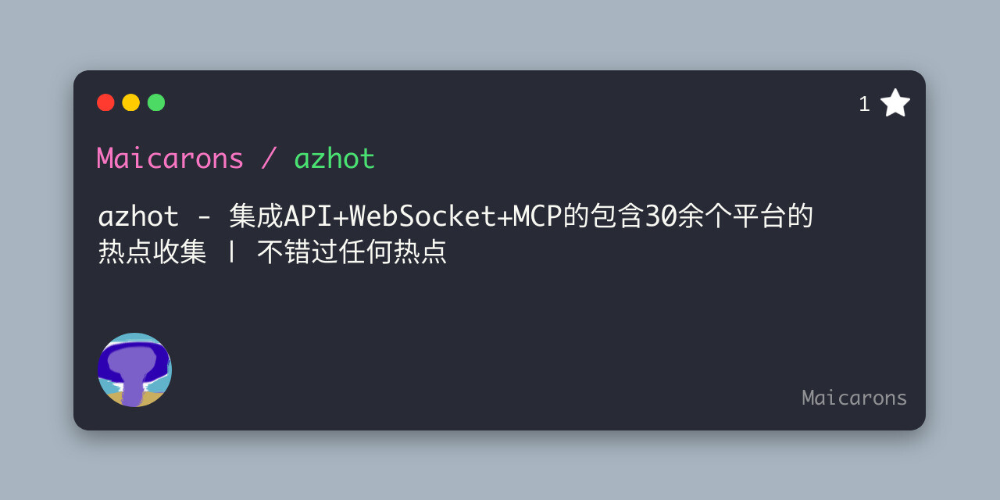

<div style="text-align: center;">

# azhot

<p align="center">
  
</p>

<p align="center">
  
</p>

[](https://www.typescriptlang.org/)
[](LICENSE)
[](https://nodejs.org/)
[](https://elysiajs.com/)

</div>

## 🌐 Traduções / Translations

- [简体中文](README.md)
- [English](README.en.md)

---

> 一个提供各大平台热搜API的聚合服务 (TypeScript + Elysia.js 版本)

## 📖 目录

- [项目简介](#项目简介)
- [功能特性](#功能特性)
- [支持平台](#支持平台)
- [快速开始](#快速开始)
- [API使用方法](#api使用方法)
- [MCP服务器](#mcp服务器)
- [开发贡献](#开发贡献)
- [许可证](#许可证)
- [问题反馈](#问题反馈)

## 项目简介

`azhot` 是一个聚合各大平台热搜数据的API服务，提供统一的接口访问各大平台的热搜内容。项目使用TypeScript开发，基于Elysia.js框架构建，支持实时获取各大平台的热搜榜单数据。

## 功能特性

- 🚀 统一API接口，获取各大平台热搜数据
- ⚡ 高性能，使用`TypeScript`+`Elysia.js`开发，带原生缓存机制
- 🔄 定时更新热搜数据，避免频繁请求目标网站
- 📚 RESTful API设计
- 🔌 支持WebSocket实时数据推送
- 🤖 支持AI Model Context Protocol (MCP) 服务器
- 📦 模块化架构，易于扩展新平台

## 项目结构

```
azhot/
├── src/                 # 源代码目录
│   ├── config/          # 配置文件
│   ├── controllers/     # 控制器
│   ├── crawlers/        # 爬虫实现
│   ├── mcp/             # MCP服务
│   ├── services/        # 业务逻辑
│   ├── types/           # 类型定义
│   ├── utils/           # 工具函数
│   └── main.ts          # 主程序入口
├── .env                 # 环境变量
├── package.json         # 项目依赖
├── Dockerfile           # Docker配置
└── README.md            # 项目说明文档
```

## 支持平台

|   名称   |  路由名  |  可用性   |
| :------: | :------: | :-------: |
|   知乎   |  zhihu   |    ✅     |
|   微博   |  weibo   |    ✅     |
|   百度   |  baidu   |    ✅     |
| 今日头条 | toutiao  |    ✅     |
| 哔哩哔哩 | bilibili |    ✅     |
| 更多平台 |   ...    | 🔄 开发中 |

## 快速开始

### 环境要求

- Node.js >= 18 或 Bun
- TypeScript >= 4.5

### 安装步骤

1. 克隆项目

```bash
git clone https://github.com/maicarons/azhot.git
cd azhot
```

2. 安装依赖

```bash
bun install
# 或 npm install / yarn install
```

3. 配置环境

```bash
# 复制配置文件
cp .env.example .env
# 编辑配置文件
vim .env
```

4. 运行项目

```bash
# 开发模式运行
bun run dev

# 或者构建后运行
bun run build
bun start
```

### 使用Docker运行

```bash
# 构建并运行
docker build -t azhot .
docker run -d -p 8080:8080 azhot
```

### 环境变量配置

项目使用 `.env` 文件进行配置，以下是可用的环境变量：

#### 服务器配置

- `SERVER_HOST`: 服务器主机地址，默认为 `localhost`
- `SERVER_PORT`: 服务器端口，默认为 `8080`

#### MCP 配置

- `MCP_STDIO_ENABLED`: 是否启用 STDIO MCP 服务器，默认为 `false`
- `MCP_HTTP_ENABLED`: 是否启用 HTTP MCP 服务器，默认为 `false`
- `MCP_PORT`: HTTP MCP 服务器端口，默认为 `8081`

#### 调试配置

- `DEBUG`: 是否启用调试模式，默认为 `false`

#### CORS 配置

- `CORS_ALLOW_ORIGINS`: 允许的跨域请求来源，多个来源用逗号分隔，默认为空表示允许所有来源

## API使用方法

### HTTP API

#### 获取所有平台列表

```
GET /list
```

获取所有支持的平台信息。

#### 获取特定平台热搜

```
GET /{platform}
```

例如获取知乎热搜：

```
GET /zhihu
```

#### 获取所有平台热搜

```
GET /all
```

获取所有平台的热搜数据聚合。

### WebSocket API

项目支持WebSocket实时数据推送，提供与HTTP API相同的路由结构。

#### 通用WebSocket端点

```
ws://localhost:8080/ws
```

连接后可以发送消息来订阅或请求特定平台数据。

#### 特定平台WebSocket端点

```
ws://localhost:8080/ws/{platform}
```

例如连接知乎热搜WebSocket：

```
ws://localhost:8080/ws/zhihu
```

#### WebSocket消息格式

```json
{
  "type": "subscribe|request|ping",
  "source": "平台名称，如baidu、zhihu等",
  "data": {}
}
```

- `subscribe`: 订阅特定平台的实时数据
- `request`: 请求一次性数据
- `ping`: 心跳消息

### API响应格式

```json
{
  "code": 200,
  "icon": "https://static.zhihu.com/static/favicon.ico",
  "message": "zhihu",
  "obj": [
    {
      "index": 1,
      "title": "2026新年贺词",
      "url": "https://www.zhihu.com/search?q=2026新年贺词"
    },
    // ...
    {
      "index": 12,
      "title": "东北网友发现「小鼻嘎」老鼠",
      "url": "https://www.zhihu.com/search?q=东北网友发现「小鼻嘎」老鼠"
    }
  ],
  "timestamp": 1640995200000
}
```

## MCP服务器

项目集成了AI Model Context Protocol (MCP) 服务器，允许AI模型和智能助手通过标准化的协议访问热搜数据。

### 功能特性

- **标准化工具接口**: 提供标准的MCP工具列表和执行接口
- **热搜数据访问**: 支持通过工具获取各平台热搜数据
- **多种部署模式**: 支持HTTP模式

### 启用MCP服务器

在 `.env` 文件中配置以下选项：

```env
MCP_HTTP_ENABLED=true       # 启用HTTP MCP服务器
MCP_PORT=8081               # HTTP MCP服务器端口
```

### MCP工具列表

- `get_hot_search`: 获取指定平台的热搜数据
- `get_all_hot_search`: 获取所有平台的热搜数据聚合
- `get_platform_list`: 获取支持的平台列表

### MCP端点

- `/mcp/tools` - 获取可用工具列表
- `/mcp/tool/execute` - 执行指定工具
- `/mcp/prompts` - 获取可用提示词列表
- `/mcp/ping` - 健康检查端点
- `/mcp/.well-known/mcp-info` - MCP服务器元数据

### 使用示例

通过HTTP调用MCP工具：

```bash
curl -X POST http://localhost:8080/mcp/tool/execute \
  -H "Content-Type: application/json" \
  -d '{
    "method": "tool/execute",
    "params": {
      "name": "get_hot_search",
      "arguments": {
        "platform": "zhihu"
      }
    },
    "id": "req-1",
    "jsonrpc": "2.0"
  }'
```

## 开发贡献

我们欢迎任何形式的贡献！如果您想为项目做出贡献，请按照以下步骤操作：

1. Fork 本项目
2. 创建功能分支 (`git checkout -b feature/AmazingFeature`)
3. 提交更改 (`git commit -m 'Add some AmazingFeature'`)
4. 推送到分支 (`git push origin feature/AmazingFeature`)
5. 创建 Pull Request

### 本地开发

```bash
# 安装依赖
bun install

# 运行开发服务器
bun run dev

# 构建项目
bun run build
```

## 许可证

本项目采用 AGPL-3.0 许可证 - 详情请参阅 [LICENSE](LICENSE) 文件。

## 问题反馈

如果你在使用过程中遇到问题或有任何建议，欢迎提交 Issue 或 Pull Request。

- 🐛 [问题报告](https://github.com/maicarons/azhot/issues)
- ✨ [功能建议](https://github.com/maicarons/azhot/issues)

---

> 🌟 如果这个项目对你有帮助，请给我们一个 Star！这将是对我们最大的支持！
